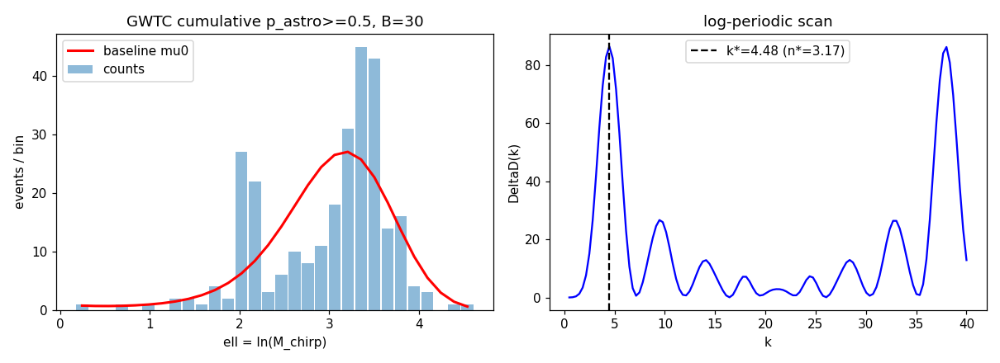

# RESULTS

WCT-motivated GWTC log-domain residual diagnostic. **This is a diagnostic
harness only — it does not prove WCT and does not replace LVK population
inference.** All results below are reproducible via [REPRODUCE.md](REPRODUCE.md).

## Historical GWTC-4 population-level aggregate result

A prior GWTC-4 catalog-scan analysis reported a strong departure from uniformity
across **168 scan-max p-values**:

| population statistic | reported result | nominal one-sided Gaussian equivalent |
|---|---:|---:|
| distribution nonuniformity | `chi^2 = 95.6`, `p_unif < 1e-15` | **`Z > 7.94 sigma`** |
| count excess at `p < 0.10` | 47 / 168 observed vs 16.8 expected; Poisson-tail `p < 1e-10` | **`Z > 6.36 sigma`** |

These are **aggregate population statistics**, not individual-event or
single-subset significances. The sigma values are nominal Gaussian-equivalent
conversions of the reported analytic p-values. Because the catalog scans are
partially overlapping/correlated, these values should **not** be presented as a
globally calibrated `>7.9 sigma` WCT detection.

A definitive global-significance statement requires a catalog-level null
ensemble that reproduces the complete selection, ranking, scan, and aggregation
workflow and directly calibrates the final population statistic under the null.
The historical aggregate result is therefore reported here for completeness but
is **not used to assign the current repository verdict** below.

## Catalog source and event counts

- **Source**: official GWOSC Event API,
  `https://gwosc.org/eventapi/json/allevents/` (see [PROVENANCE.md](PROVENANCE.md)).
- **Total event entries** across all catalogs: 671.
- **Unique events** (by common name): 433.
- **Cumulative deduplicated, `p_astro >= 0.5`**: **386 events** — consistent
  with the public GWTC-5.0 abstract's "roughly 390 transients".
- Catalogs include GWTC-4.0 (129), GWTC-4.1 (140), GWTC-5.0 (161), plus earlier
  releases.

## Variables available

`M_chirp`, `M_total`, `mass_1_source`, `mass_2_source`, `M_final`, `D_L`,
`redshift`, `chi_eff` (bounded, diagnostic only), `p_astro`, `far`.
`E_rad` and peak luminosity are **not** in the GWOSC summary table → reported
unavailable.

## Declared primary

- **Variable**: `M_chirp` (source-frame chirp mass), coordinate `ell = ln(M_chirp)`.
- **Subset**: cumulative deduplicated, `p_astro >= 0.5` (277 events with a
  finite positive `M_chirp`).
- **k-grid**: 0.5 .. 40.0, 120 points. **Null**: parametric Poisson bootstrap,
  `N_null = 1000`, seed 12345.

## Primary result (bin_count = 20)

| quantity      | value      |
|---------------|------------|
| `k_star`      | 32.70      |
| `n_star`      | 23.13      |
| `DeltaD_star` | 80.41      |
| `local_p`     | 3.5e-18 (diagnostic only) |
| `global_p`    | **0.0040** |
| `N_null`      | 1000       |

## Stress tests

**Bin-count stress** (`tables/gwtc_bin_stress.csv`):

| B  | k_star | n_star | global_p |
|----|--------|--------|----------|
| 20 | 32.70  | 23.13  | 0.0025   |
| 30 |  4.48  |  3.17  | 0.0025   |
| 40 |  4.48  |  3.17  | 0.0025   |
| 50 |  4.48  |  3.17  | 0.0025   |

`n_star` is **not stable** across the full declared bin set (CV = 1.06). The
coarse `B = 20` produces an **aliased high-k peak** (`k ~ 33`, above the
`B = 20` Nyquist frequency). For finer binning (`B >= 30`) the peak settles at
`k ~ 4.48`, `n_star ~ 3.17`. The harness therefore flags the candidate as
**bin-fragile**.

**Variable stress** (`tables/gwtc_variable_stress.csv`): all scale variables
return `global_p ~ 0.0025-0.005` at high, bin-fragile `k`. Notably the bounded
non-scale coordinate `|chi_eff|` is **equally significant** (`global_p ~ 0.0025`)
→ the detected mode is **not specific to scale-like variables**.

**Threshold / observing-run stress** (`tables/gwtc_threshold_stress.csv`):
significant under `p_astro >= 0.5`, `p_astro >= 0.9`, `FAR < 1/yr`, BBH-only,
O3a, O4a, O4b; weaker in O3b (`global_p ~ 0.07`).

**Negative controls** (`tables/gwtc_control_results.csv`):

| control          | global_p range | reading |
|------------------|----------------|---------|
| `smooth_resample`| 0.19 – 0.61    | structureless → **does not beat primary** (null well-calibrated) |
| `uniform_ell`    | 0.16 – 0.91    | structureless → **does not beat primary** |
| `jitter`         | 0.0025 – 0.0075| candidate **survives** posterior jitter (robustness positive) |
| `bounded_chi_eff`| 0.0025         | non-scale coordinate is **also significant** (coordinate non-specific) |

## Verdict

**VERDICT: PARTIAL — Reliability Class III** (`tables/gwtc_verdict.csv`,
`outputs/summary/VERDICT.txt`).

The primary is statistically significant under the 1000-replicate Poisson
bootstrap, and structureless controls do **not** beat it (the scan does not
manufacture significance on structureless data). However it fails two
robustness layers:

1. **Bin-fragility**: `n_star` is not stable across bin counts (coarse `B = 20`
   gives an aliased high-k peak; `B >= 30` collapses to `n_star ~ 3.17`).
2. **Coordinate non-specificity**: the bounded non-scale coordinate `|chi_eff|`
   is equally significant, so the mode is not specific to scale-like variables.

### Interpretation (bounded)

The large deviance improvement almost certainly reflects **known astrophysical
GWTC mass-function structure** (the well-documented ~10 M☉ and ~35 M☉ chirp/
component-mass over-densities) that a deliberately simple degree-3 Poisson
baseline cannot absorb — **not** a universal WCT log-periodic winding. This is
a **candidate log-domain residual** that is **bin-fragile and
coordinate-non-specific**, and it **requires independent confirmation** with a
more flexible baseline before any stronger statement. The harness remains
**diagnostic only**.

No result reaches **Class I**. The current best class is **Class III**. There
are no Class IV (pure-null) primary findings, but the structureless controls
behave as expected Class IV references.

