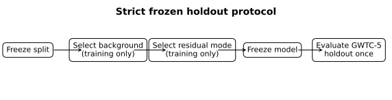
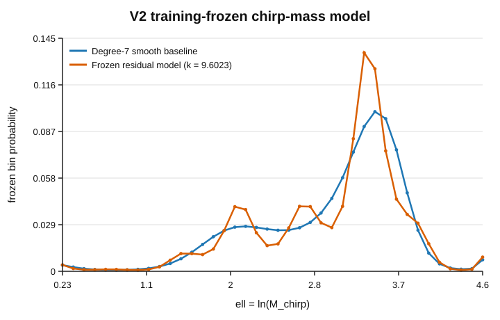
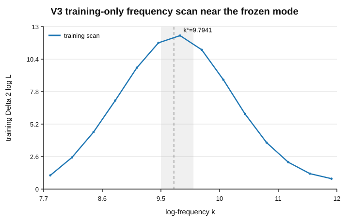
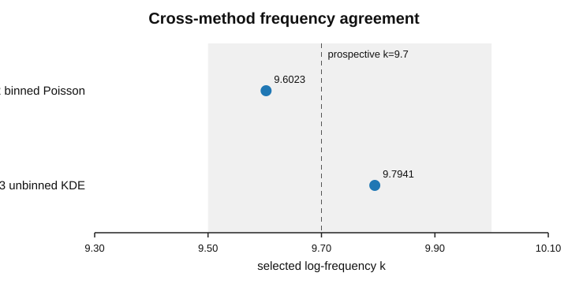
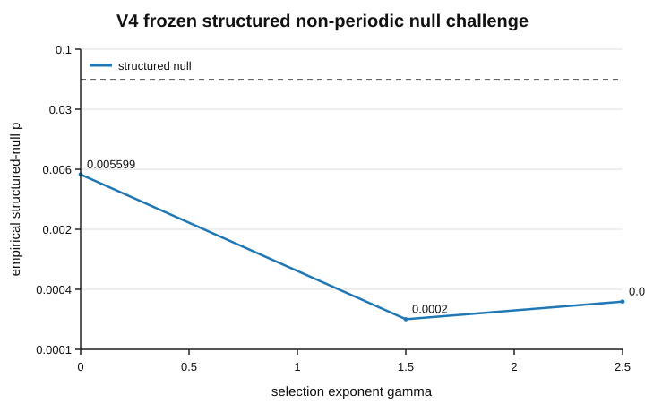
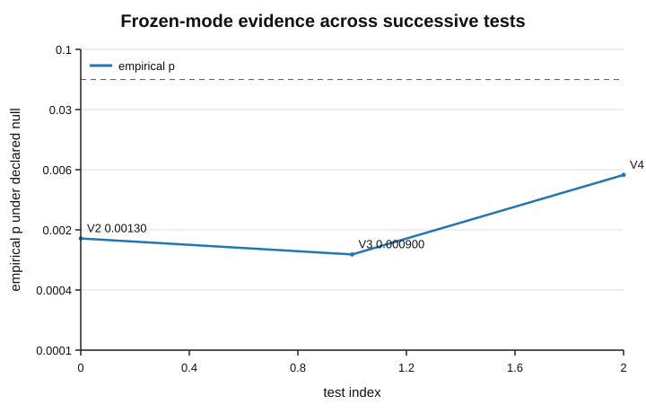

# Publication figures

These figures are the publication-facing visual summary of the **strict frozen-mode evidence chain**. They are intentionally separated from the historical exploratory `figures/scan_M_chirp_B30.png` image.

The source values come from the committed V2/V3/V4 frozen and result artifacts. Regenerate the figure set with:

```bash
python scripts/make_publication_figures.py
```

By default the script writes both SVG and PNG outputs into `figures/publication/`. PDF output is also supported, for example:

```bash
python scripts/make_publication_figures.py --formats svg,png,pdf
```

## Figure set

### 1. Strict frozen holdout protocol



**Suggested paper location:** Section 4, immediately after the frozen holdout protocol is defined.

The sequence is the central methodological safeguard:

```text
freeze split -> select background on training -> select residual on training -> freeze model -> evaluate GWTC-5 holdout once
```

### 2. V2 training-frozen chirp-mass model



**Suggested paper location:** Section 5, after the V2 residual model is defined.

Shows the degree-7 training-selected smooth baseline and the frozen residual model with `k = 9.6023` using the probabilities stored in `tables/gwtc_frozen_mode.json`.

### 3. V3 training-only frequency scan near the frozen mode



**Suggested paper location:** Section 6, after the V3 training optimization.

The prospective `9.5 <= k <= 10.0` interval is shown around the V3 training maximum `k = 9.7941`. The holdout is not used to choose the scan maximum.

### 4. Cross-method frequency agreement



**Suggested paper location:** Section 7, adjacent to the V2/V3 comparison table.

V2 selects `k = 9.6023`; V3 selects `k = 9.7941`. Both lie inside the preregistered prospective interval centered on `k = 9.7`.

### 5. V4 structured non-periodic null challenge



**Suggested paper location:** the revised structured-null section. The existing August 26 manuscript describes this as future work, but the repo now contains the completed V4 result.

The three predeclared selection scenarios give empirical p-values:

| selection gamma | empirical p |
|---:|---:|
| `0.0` | `0.0055994401` |
| `1.5` | `0.0001999800` |
| `2.5` | `0.0002999700` |

Worst-case p: `0.0055994401`.

### 6. Frozen-mode evidence summary



**Suggested paper location:** Discussion or conclusion.

This panel summarizes the empirical p-values under the **different declared nulls** used by V2, V3, and V4. It is a visual evidence hierarchy, not a combined significance calculation. The values must not be multiplied because the tests are not independent and do not share an identical null model.

## Interpretation guardrails

- V2 is the strict frozen holdout test.
- V3 is a robustness reformulation on the already-inspected GWTC-5 holdout, not an independent catalog replication.
- V4 is a structured non-periodic population-null challenge, also not an independent catalog replication.
- The historical GWTC-4 aggregate scan remains descriptive/historical and should not be presented as the primary figure set for the frozen `k ~ 9.7` program.
- None of these figures by themselves establish WCT or replace a full LVK posterior-aware hierarchical population and selection analysis.
